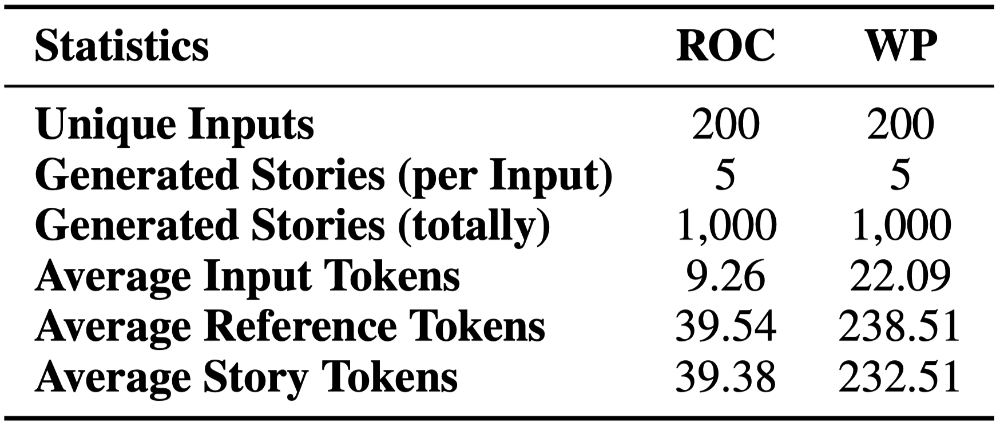
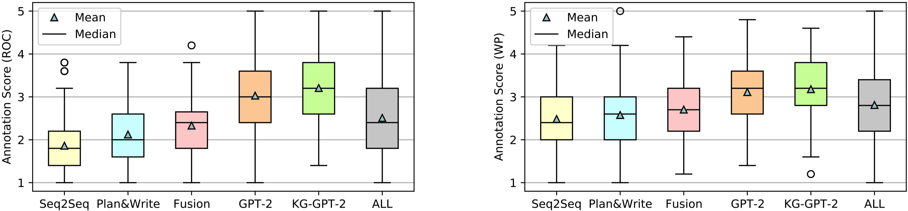
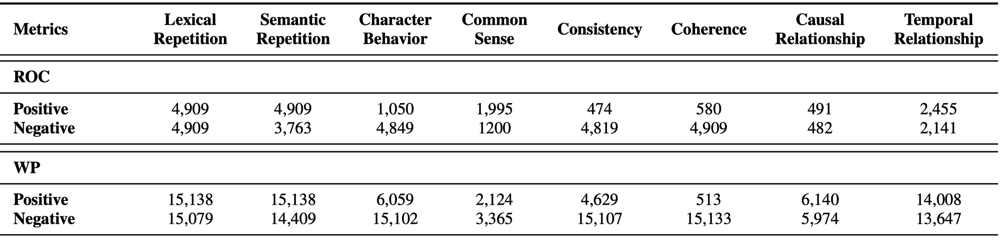
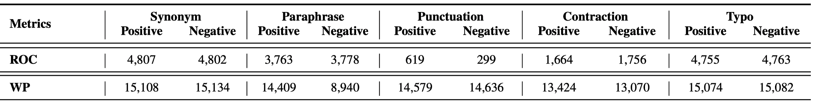
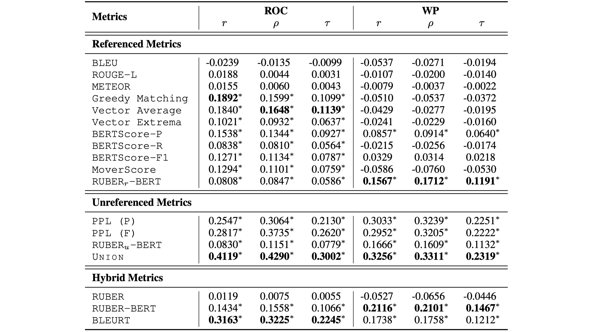
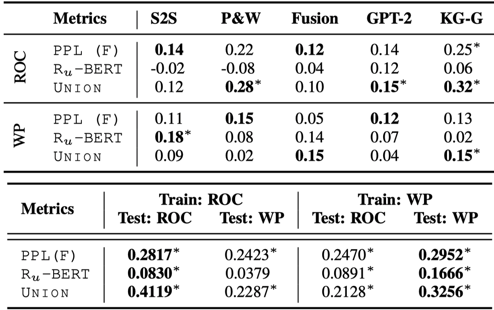
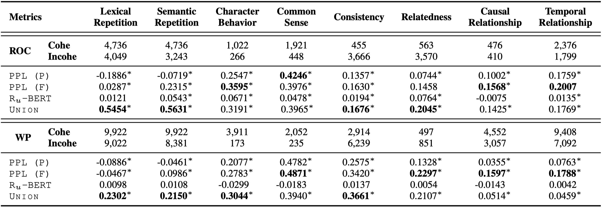
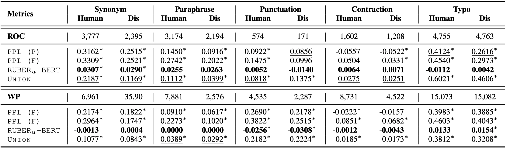

# OpenEVA
  

Contributed by [Jian Guan](https://jianguanthu.github.io/), [Zhexin Zhang](https://github.com/nonstopfor)

OpenEVA is a benchmark for evaluating open-ended story generation (Please refer to the [Paper List](https://github.com/thu-coai/PaperForONLG) for more information about **O**pen-e**N**ded **L**anguage **G**eneration tasks). Besides, OpenEVA also provides an open-source and extensible toolkit for metric implementation, evaluation, comparison, and analysis, as well as data perturbation techniques to help generate large numbers of customized test cases. We expect the toolkit to empower fast development of automatic metrics.

### Contents

* [Introduction to Language Generation Evaluation](#introduction-for-language-generation-evaluation)
* [Install](#install)
* [Toolkit](#toolkit)
  * [I. Metric Interface](#i-metrics-interface)
    * [Metric List](#1-metric-list)
    * [Usage](#2-usage)
    * [Training Learnable Metrics](#3training-learnable-metrics)
  * [II. Evaluating Human Score](#ii-evaluating-human-scores)
    * [Constructing](#1-constructing)
    * [Consistency](#2-consistency-of-human-scores)
    * [Mean Test](#3-mean-test-for-scores-of-examples-from-different-source)
    * [Distribution](#4-distribution-of-human-scores)
    * [Correlation](#5-correlation-between-human-and-metric-scores)
  * [III. Perturbation Techniques](#iii-perturbation-techniques)
    * [Perturbation List](#1-perturbation-list)
    * [Usage](#2-usage-1)
* [IV. Benchmark](#benchmark)
  * [I. Datasets](#i-datasets)
    * [1. MAGS](#1-machine-generated-stories-mags-with-manual-annotation)
    * [2. ACTS](#2-auto-constructed-stories-acts)
    * [3. Download & Instruction](#3-download--data-instruction)
  * [II. Tasks](#ii-tasks)
    * [1. Correlation]()
    * [2. Generalization](#2-generalization-across-generation-models-and-dataset-for-learnable-metrics-based-on-mags)
    * [3. Judgment](#3-judgment-in-general-linguistic-features--based-on-the-discrimination-test-set-of-acts)
    * [4. Robustness](#4-robustness-to-rationality-preserving-perturbations--based-on-the-invariance-test-set-of-acts)
    * [5. Fast Test](#5-fast-test)

- [V. How to Cite](#v-how-to-cite)


## Introduction for Language Generation Evaluation

Since **human evaluation** is **time-consuming**, **expensive**, and **difficult to reproduce**, the community commonly uses **automatic metrics** for evaluation. We roughly divide existing metrics as follows:

- Previous studies in **conditional language generation** tasks (e.g., machine translation) have developed several successful **referenced metrics**, which roughly quantify the *lexical overlap* (e.g., [BLEU](https://www.aclweb.org/anthology/P02-1040)) or *semantic entailment* (e.g., [BertScore](https://openreview.net/forum?id=SkeHuCVFDr)) between a generated sample and the reference. 
- Referenced metrics correlate poorly with human judgments when evaluating **open-ended language generation**. Specifically, a generated sample can be reasonable if it is coherent to the given input, and self-consistent within its own context but not necessarily being similar to the reference in literal or semantics.  To address the one-to-many issue, **unreferenced metrics** (e.g., [UNION](https://www.aclweb.org/anthology/2020.emnlp-main.736/)) are proposed to measure the quality of a generated sample without any reference. 
- Besides, some researchers propose to combine referenced and unreferenced metrics, i.e. **hybrid metrics**, which usually average two individual metric scores (e.g. [RUBER](https://arxiv.org/abs/1701.03079)) or learn from human preference (e.g., [ADEM](https://www.aclweb.org/anthology/P17-1103)). However, ADEM is reported to lack generalization and robustness with limited human annotation.

The existing generation models are still far from human ability to generate reasonable texts, particularly for open-ended language generation tasks such as story generation. One important factor that hinders the research is the lack of powerful metrics for measuring generation quality. Therefore, we propose OpenEVA as the standard paradigm for measuring progress of metrics.


## Install 

Clone the repository from our github page (don't forget to star us!)

```bash
git clone https://github.com/thu-coai/OpenEVA.git
```

Then install all the requirements:

```
pip install -r requirements.txt
```

Then install the package with 

```
python setup.py install
```

If you also want to modify the code, run this:

```
python setup.py develop
```


## Toolkit

### I. Metrics Interface

#### 1. Metric List

We publish the standard implementation for the following metrics:

- [BLEU](https://www.aclweb.org/anthology/P02-1040) (geometric mean of 1-gram to 4-gram) 
- [METEOR](https://www.aclweb.org/anthology/W05-0909)
- [ROUGE](https://www.aclweb.org/anthology/W04-1013) (-1, -2, -L, precision, recall, F1)
- Embedding-based Metric ([Greedy Matching](https://link.springer.com/chapter/10.1007/978-3-642-30950-2_116), [Vector Average](https://doi.org/10.1037/0033-295X.104.2.211), [Vector Extrema](http://www.cs.cmu.edu/~apparikh/nips2014ml-nlp/camera-ready/forgues_etal_mlnlp2014.pdf))
- [BERTScore](https://openreview.net/forum?id=SkeHuCVFDr) (precision, recall, F1)
- [MoverScore](https://www.aclweb.org/anthology/D19-1053/) (1-gram, 2-gram)
- Forward Perplexity (based on the pretrained language model or fine-tuned language model)
- [UNION](https://www.aclweb.org/anthology/2020.emnlp-main.736/)
- [BLEURT](https://arxiv.org/abs/2004.04696)
- RUBER ([RNN-version](https://arxiv.org/abs/1701.03079), [BERT-version](https://www.aclweb.org/anthology/W19-2310.pdf))


#### 2. Usage

It is handy to construct a metric object and use it to evaluate given examples:

```python
from eva.bleu import BLEU
metric = BLEU()

# for more information about the metric
print(metric.info)

# data is a list of dictionary [{"context": ..., "candidate":..., "reference": ...}]
print(metric.compute(data))
```

We present a python file [test.py](https://github.com/thu-coai/OpenEVA/blob/main/test.py) as an instruction to access the API. 

These metrics are not exhaustive, it is a starting point for further metric research. **We welcome any pull request for other metrics** (requiring implementation of only three methods including `__init__`, `info`, `compute`).


#### 3.Training Learnable Metrics

Execute the following command for training learnable metrics:

```bash
cd ./eva/model

# training language model for computing forward perplexity
bash ./run_language_modeling.sh

# training the unreferenced model for computing RUBER (RNN version)
bash ./run_ruber_unrefer.sh

# training the unreferenced model for computing RUBER (BERT version)
bash ./run_ruber_unrefer_bert.sh

# training the model for computing UNION
bash ./run_union.sh
```


### II. Evaluating Human Scores

The python file [test.py](https://github.com/thu-coai/OpenEVA/blob/main/test.py) also includes detailed instruction to access the API for evaluating human scores. 

#### 1. Constructing

```python
from eva.heva import Heva

# list of all possible human scores (int/float/str).
all_possible_score_list = [1,2,3,4,5]

# construct an object for following evaluation
heva = Heva(all_possible_score_list)
```


#### 2. Consistency of human scores

```python
# list of human score list, each row includes all the human scores for an example
human_score_list = [[1,3,2], [1,3,3], [2,3,1], ...]

print(heva.consistency(human_score_list))
# {"Fleiss's kappa": ..., "ICC correlation": ..., "Kendall-w":..., "krippendorff's alpha":...}
# the results includes correlation and p-value for significance test.
```


#### 3. Mean Test for scores of examples from different source

```python
# list of metric scores (float)
metric_score_1, metric_score_2 = [3.2, 2.4, 3.1,...], [3.5, 1.2, 2.3, ...]

# T-test for the means of two independent samples of scores.
print(heva.mean_test(metric_score_1, metric_score_2))
# {"t-statistic": ..., "p-value": ...}
```


#### 4. Distribution of human scores

```python
# list of human scores (float)
human_score = [2.0, 4.2, 1.2, 4.9, 2.6, 3.1, 4.0, 1.5,...]

# path for saving the figure of distribution
figure_path = "./figure"

# indicating the source of the annotated examples. default: ""
model_name = "gpt"

# plot the figure of distribution of human scores
heva.save_distribution_figure(score=human_score, save_path=figure_path, model_name=model_name, ymin=0, ymax=50)
```


#### 5. Correlation between human and metric scores

```python
# list of human scores (float)
human_score = [2.0, 4.2, 1.2, 4.9, 2.6, 3.1, 4.0, 1.5,...]

# list of metric scores (float)
metric_score = [3.2, 2.4, 3.1, 3.5, 1.2, 2.3, 3.5, 1.1,...]

# computing correlation
print(heva.correlation(metric_score, human_score))

# path for saving the figure of distribution
figure_path = "./figure"

# indicating the source of the metric scores. default: ""
metric_name = "bleu"

# plot the figure of metric score vs. human scores
heva.save_correlation_figure(human_score, metric_score, save_path=figure_path, metric_name=metric_name)
```


### III. Perturbation Techniques

#### 1. Perturbation List

We provide perturbation techniques in following aspects to create large scale test cases for evaluating comprehensive capabilities of metrics:

- **Lexical repetition**

  - Repeating n-grams or sentences:

    <blockquote>He stepped on the stage <b>and stepped on the stage.</b></blockquote>

- **Semantic repetition**: 

  - Repeating sentences with paraphrases by back translation:

    <blockquote><p> He has been from Chicago to Florida. <b>He moved to Florida from Chicago.</b> </p></blockquote>

- **Character behavior**:

  - Reordering the subject and object of a sentence:

    <blockquote>Lars looked at the girl with desire.&rarr; the girl looked at Lars with desire. </blockquote>

  - Substituting the personal pronouns referring to other characters:

    <blockquote>her mother took them to ... &rarr; their mother took her to ... </blockquote>

- **Common sense**:

  - Substituting the head or tail entities in a commonsense triple of [ConcepNet](https://www.conceptnet.io):

    <blockquote> Martha puts her dinner into theoven. She lays down fora quick nap. She oversleeps and runs into the kitchen (&rarr; <b>garden</b>) to take out her burnt dinne. </blockquote>

- **Consistency**: 

  - Inserting or Deleting negated words or prefixes:

    <blockquote> She <b>had (&rarr; did not have)</b> money to get vaccinated. She had a flu shot ... </blockquote>

    <blockquote> She <b>agreed (&rarr; disagreed)</b> to get vaccinated. </blockquote>

  - Substituting words with antonyms:

    <blockquote> She is <b>happy (&rarr; upset)</b> that she had a great time ... </blockquote>

- **Coherence**: 

  - Substituting words, phrases or sentences:

    <blockquote> Christmas was very soon. <b>Kelly wanted to put up the Christmas tree. (&rarr; Eventually it went into remission.)</b> </blockquote>

- **Causal Relationship**:

  - Reordering the cause and effect:

    <blockquote> <b>the sky was clear</b> so <b>he could see clearly the boat</b>. &rarr;  <b>he could see clearly the boat</b> so <b>the sky was clear</b>. </blockquote>

  - Substituting the causality-related words randomly:

    <blockquote> the sky was clear<b> so (&rarr; because) </b> he could see clearly the boat. </blockquote>

- **Temporal Relationship**:

  - Reordering two sequential events:

    <blockquote> <b>I eat one bite.</b> Then <b>I was no longer hungry.</b> &rarr; <b>I was no longer hungry.</b> Then <b>I eat one bite.</b> </blockquote>

  - Substituting  the  time-related words:

    <blockquote> <b>After (&rarr; Before) </b> eating one bite I was no longer hungry. </blockquote>

- **Synonym**:

  - Substituting a word with its synonym:

    <blockquote> I just <b>purchased (&rarr; bought)</b> my uniforms. </blockquote>

- **Paraphrase**:

  - Substituting a sentence with its paraphrase by back translation:

    <blockquote> <b>Her dog doesn't shiver anymore.</b> &rarr; <b>Her dog stops shaking.</b> </blockquote>

- **Punctuation**:

  - Inserting or Deleting inessential punctuation mark:

    <blockquote> <b>Eventually,</b> &rarr; <b>Eventually</b> he became very hungry. </blockquote>

- **Contraction**:

  - Contracting or Expanding contraction:

    <blockquote> <b>I’ll (&rarr; I will)</b> have to keep waiting .</blockquote>

- **Typo**:

  - Swapping two adjacent characters:

    <blockquote> that <b>orange (&rarr; ornage)</b> broke her nose. </blockquote>

  - Repeating or Deleting a character:

    <blockquote> that <b>orange (&rarr; orannge) </b>broke her nose. </blockquote>


#### 2. Usage

It is handy to construct a perturbation object and use it to perturb given examples:

```python
from eva.perturb.perturb import *
custom_name = "story"
method = add_typos(custom_name)

# data is a list of dictionary [{"id":0, "ipt": ..., "truth":...}, ...]
print(method.construct(data))
# the perturbed examples can be found under the directory "custom_name"
```

We present a python file [test_perturb.py](https://github.com/thu-coai/OpenEVA/blob/main/test_perturb.py) as an instruction to access the API. 

You can download dependent files for some perturbation techniques by executing the following command:

```bash
cd ./eva/perturb
bash ./download.sh
```

You can also download them by [THUCloud](https://cloud.tsinghua.edu.cn/d/1871916bd7a34ee1a436/) or [Google Drive](https://drive.google.com/drive/folders/11RaK4e_1D0s_1Nesz98eHgaDnPu_tf_2?usp=sharing).

These perturbation techniques are not exhaustive, it is a starting point for further evaluation research. **We welcome any pull request for other perturbation techniques** (requiring implementation of only two methods including `__init__`, `construct`).

**Note**:bookmark_tabs: We adopt [uda](https://github.com/google-research/uda) for back translation. We provide an example `eva/perturb/back_trans_data/story_bt.json` to indicate the format of the back translation result. And you can download the results for ROCStories and WritingPrompts by [THUCloud](https://cloud.tsinghua.edu.cn/d/e31fc38a29be446a9bc5/) or [Google Drive](https://drive.google.com/drive/folders/1-JkjvKDJh4-X6uAHKYnzFYXMsqhOX3ft?usp=sharing).


## Benchmark

### I. Datasets

#### 1. Machine-Generated Stories (MAGS) with manual annotation

We provide annotated stories from ROCStories (ROC) and WritingPrompts (WP). Some statistics are as follows:



Boxplot of annotation scores for each story source (Left: ROC, Right: WP):




#### 2. Auto-Constructed Stories (ACTS)

We create large-scale test examples based on ROC and WP by aforementioned perturbation techniques. ACTS includes examples for different test types, i.e., discrimination test and invariance test.

- The discrimination test requires metrics to distinguish human-written positive examples from negative ones. Wecreate each negative example by applying pertur-bation within an individual aspect.  Besides, we also select different positive examples targeted for corresponding aspects. Below table shows the numbers of positive and negative examples in different aspects.

  

- The invariance test expect the metric judgments to remain the same when we apply rationality-preserving perturbations, which means almost no influence on the quality of examples. The original examples can be either the human-written stories or the negative examples created in the discrimination test. Below table shows the numbers of original (also perturbed) positive and negative examples in different aspects.

  


#### 3. Download & Data Instruction

You can download the whole dataset by [THUCloud](https://cloud.tsinghua.edu.cn/d/985f728ebc7341ef9719/) or [Google Drive](https://drive.google.com/drive/folders/1zmVw2x-hKIm6Jh8phIn_Ih-PtuxMylAM?usp=sharing). 

```markdown
├── data
   └── `mags_data`
       ├── `mags_roc.json`	# sampled stories and corresponding human annotation.   
       ├── `mags_wp.json`		# sampled stories and corresponding human annotation.       
   └── `acts_data`
       ├── `roc`
              └── `roc_train_ipt.txt`	# input for training set
              └── `roc_train_opt.txt`	# output for training set
              └── `roc_valid_ipt.txt`	# input for validation set
              └── `roc_valid_opt.txt`	# output for validation set
              └── `roc_test_ipt.txt`	# input for test set
              └── `roc_test_opt.txt`	# output for test set
              └── `discrimination_test`                        
                 ├── `roc_lexical_rept.txt`
                 ├── `roc_lexical_rept_perturb.txt`										
                 ├── `roc_semantic_rept.txt`
                 ├── `roc_semantic_rept_perturb.txt`
                 ├── `roc_character.txt`
                 ├── `roc_character_perturb.txt`
                 ├── `roc_commonsense.txt`
                 ├── `roc_commonsense_perturb.txt`												
                 ├── `roc_coherence.txt`
                 ├── `roc_coherence_perturb.txt`
                 ├── `roc_consistency.txt`
                 ├── `roc_consistency_perturb.txt`								
                 ├── `roc_cause.txt`
                 ├── `roc_cause_perturb.txt`       										
                 ├── `roc_time.txt`
                 ├── `roc_time_perturb.txt`                    
              └── `invariance_test`
                 ├── `roc_synonym_substitute_perturb.txt`
                 ├── `roc_semantic_substitute_perturb.txt`
                 ├── `roc_contraction_perturb.txt`
                 ├── `roc_delete_punct_perturb.txt`
                 ├── `roc_typos_perturb.txt`
                 ├── `roc_negative_sample.txt`	# sampled negative samples from the discrimination test.	
                 ├── `roc_negative_sample_synonym_substitute_perturb.txt`
                 ├── `roc_negative_sample_semantic_substitute_perturb.txt`
                 ├── `roc_negative_sample_contraction_perturb.txt`
                 ├── `roc_negative_sample_delete_punct_perturb.txt`
                 ├── `roc_negative_sample_typos_perturb.txt`
       ├── `wp`
              └── ...
```


### II. Tasks

OpenEVA includes a suite of tasks to test comprehensive capabilities of metrics:

#### 1. Correlation with human scores (based on MAGS)



#### 2. Generalization across generation models and dataset (for learnable metrics, based on MAGS)



#### 3. Judgment in general linguistic features  (based on the discrimination test set of ACTS)



#### 4. Robustness to rationality-preserving perturbations  (based on the invariance test set of ACTS)



**Note:** The smaller absolute value of correlation is the better.

#### 5. Fast Test

You can test these capabilities of new metrics by following command:

```bash
cd ./benchmark

# test correlation with human scores and generalization
python ./corr_gen.py

# test judgment
python ./judge.py

# test robustness
python ./robust.py
```

We take BLEU and Forward Perplexity as examples in the python files. You can test your own metrics by minor modification.


## V. How to Cite

```

```

It's our honor to help you better explore language generation evaluation with our toolkit and benchmark.
